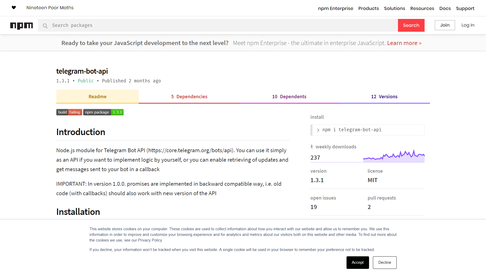

# nodejs-telegram-bot

**1.** main API: [node-telegram-bot-api](https://github.com/yagop/node-telegram-bot-api)

**2.** Additional API
**3.** Usage Libraries:
- [nodemon](https://www.npmjs.com/package/nodemon)
`npm i nodemon`
- [request](https://github.com/request/request)
`npm i request -D`